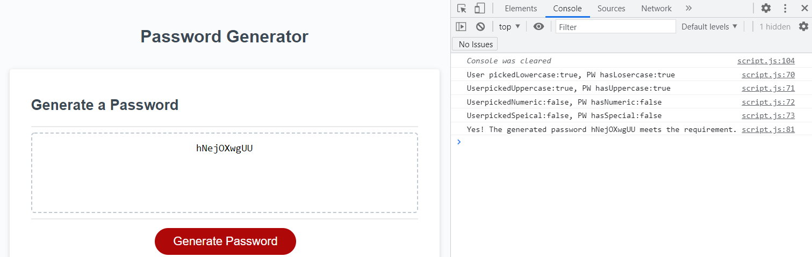
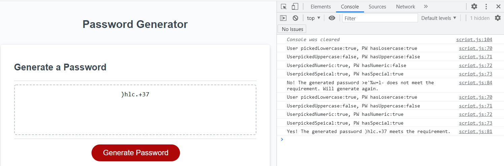

# Password Generator

This is a password generator which let's you generate password using different selected types such as upper case, lower case, numbers and speical characters.

## Password Limit

In the first part, it asks use for length of the password they like. It has to be between 8 and 128 otherwise it will have an alert. If user cancels the pop up window, then nothing happens.

## Asks user for password type

In the second part, it continues to ask for the types a user wants (at least one). If a user picked a type, combine the array into a merged arrage for randomlly generating password later.

## Generate the password

Then it generates a password randomly from the merged array (which includes all the characters of types selected).

Then it checks if the generated password does include all types selected.

If yes, display the password on the screen.
If no, generate a different password until it meets all criteria

## Console logs

If you want to check what types a user pick, does the generated password include the types, and what the password looks like, un-comment these lines: 71-74, 82, 85, 105.

```
Line 71-74:
    console.log("User pickedLowercase:"+pickedLowercase+", PW hasLosercase:"+hasLosercase);
    console.log("UserpickedUppercase:"+pickedUppercase+", PW hasUppercase:"+hasUppercase);
    console.log("UserpickedNumeric:"+pickedNumeric+", PW hasNumeric:"+hasNumeric);
    console.log("UserpickedSpeical:"+pickedSpeical+", PW hasSpecial:"+hasSpecial);
Line 82:
    console.log("Yes! The generated password "+generatedPassword+ " meets the requirement.");
Line 85:
    console.log("No! The generated password "+generatedPassword+ " does not meet the requirement. Will generate again.");
Line 105:
    console.clear();
```

## Link

Please go to [LINK](https://shaotangyen.github.io/password-generator/) to check out the final page.

Or [Link](https://github.com/shaotangyen/password-generator) to go to GitHub page.

## Screenshot examples


An example of a successfully generated password.


An example of a password that does not meet the requirement (first five lines in console), then re-generated and succeed.